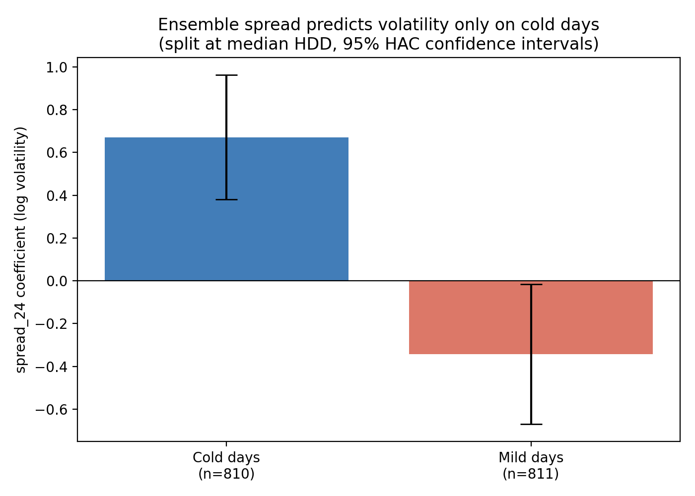
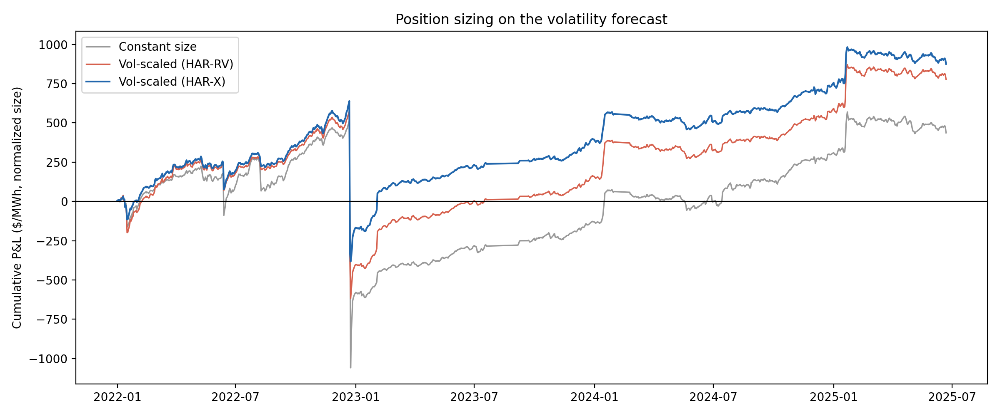

# PJM Volatility Forecasting from Weather Ensemble Spread

Weather forecasts come with a built-in measure of their own uncertainty. NOAA's GEFS model runs 31 simulations of the atmosphere at once, each starting from a slightly different initial state. When all 31 agree tomorrow will be 40°F, the forecast is confident. When they range from 28°F to 45°F, the atmosphere is hard to predict. That disagreement is called ensemble spread, and it is free and public.

Electricity demand is mostly weather driven. Power cannot be stored at scale, so supply has to match demand in real time, and the supply stack is lumpy: as demand climbs you move from cheap baseload to expensive peakers in discrete jumps. My hypothesis is that uncertain weather should mean uncertain demand, which should mean uncertain prices (volatility).

This project tests that chain on PJM real-time prices from 2020 to 2025, then asks whether the signal is profitable.

## Summary of findings

Four results, in the order I found them:

1. Ensemble spread predicts real-time volatility, but only when it is cold. On cold days the coefficient is 0.69 (p < 0.0001). On mild days it is roughly zero.
2. Adding the signal to a HAR-RV benchmark improves out-of-sample QLIKE loss by 3.8% and raises out-of-sample R² from 0.073 to 0.235. The Diebold-Mariano test does not find this significant (p = 0.27).
3. The signal contains no information beyond what day-ahead prices already imply. Controlling for day-ahead price dispersion, the interaction term goes from p < 0.001 to p = 0.20. Thus, PJM prices weather uncertainty efficiently.
4. It still has economic value. Using the forecast to size a short-premium position raises the Sharpe ratio from 0.16 to 0.39 and cuts maximum drawdown by 35%.



## 1. The signal is conditional on cold weather

Splitting at median heating degree days:

| | n | spread coefficient | p | 95% CI |
|---|---|---|---|---|
| Cold days | 795 | **0.690** | <0.0001 | [0.39, 0.99] |
| Mild days | 795 | −0.379 | 0.023 | [−0.71, −0.05] |

A 1K increase in ensemble spread on a cold day is associated with about a 69 log-point increase in next-day realized volatility. On mild days the effect vanishes. The small negative is marginal and I do not read anything causal into it.

The same structure appears as an interaction on the full sample:

| Model | R² | Adj. R² |
|---|---|---|
| Controls only | 0.3471 | 0.3447 |
| + ensemble spread | 0.3502 | 0.3473 |
| + spread × HDD | **0.3632** | 0.3600 |

The interaction coefficient is 0.068 with t = 4.75 under Newey-West standard errors. Spread on its own is insignificant (p = 0.39), which makes sense once you see the split. Pooling averages a strong cold-weather effect together with nothing.

Why cold and not hot? Heating load responds more steeply to temperature than cooling load, so the same forecast error moves winter demand further. Cold snaps stress supply at the same time through gas freeze-offs and forced outages. And a heat dome builds slowly and visibly while winter storm timing stays uncertain until close in. By the time a hot day arrives, peakers are committed and reserves are scheduled, so marginal uncertainty is worth less.

I got this backwards at first. My initial interaction used cooling degree days, and it came back significant and negative, which is what sent me to look at HDD.

### Walk-forward stability

Retraining on everything before each test year:

| Test year | spread × HDD | OOS R² | n train | n test |
|---|---|---|---|---|
| 2022 | 0.095 | 0.313 | 419 | 362 |
| 2023 | 0.082 | 0.152 | 781 | 301 |
| 2024 | 0.072 | 0.167 | 1082 | 336 |
| 2025 | 0.073 | −0.019 | 1418 | 172 |

Positive in every window, mean 0.081. The coefficient drifts down over time and 2025 is weak, though 2025 is a partial year since price data ends June 22. Could be market adaptation. Could be noise. Four years is not enough to tell.

### The pattern strengthens toward the tail, though only the median survives bootstrap

Quantile regression on log volatility. `quantreg` reports IID standard errors, which are optimistic here, so I bootstrapped 500 resamples.

| Quantile | Coefficient | p | Bootstrap CI | Survives? |
|---|---|---|---|---|
| 0.10 | 0.225 | 0.184 | | |
| 0.25 | 0.152 | 0.212 | | |
| 0.50 | 0.331 | 0.005 | [0.05, 0.58] | yes |
| 0.75 | 0.200 | 0.131 | | |
| 0.90 | 0.381 | 0.022 | [−0.03, 0.72] | **no** |
| 0.95 | 0.471 | 0.050 | | |

Point estimates climb from 0.15 at the 25th percentile to 0.47 at the 95th, and nothing shows up on calm days, which fits the mechanism. Uncertainty only matters once the supply stack is steep. But under bootstrap only the median holds. The 90th percentile interval covers zero by a hair and the 95th has roughly 80 observations behind it. The tail pattern is real enough to describe and not strong enough to claim.

## 2. Forecasting: HAR-RV benchmark

The standard benchmark for realized volatility is HAR-RV (Corsi 2009), which regresses volatility on its own daily, weekly, and monthly lags. I did not use GARCH. GARCH infers latent volatility from daily returns, while realized volatility is directly observable from 24 hourly prices, and the electricity volatility literature consistently finds HAR-type models dominate GARCH-type models for this target.

HAR-X adds `spread_24` and the HDD interaction to the HAR lags. Comparison uses QLIKE loss rather than MSE, since MSE over-penalizes errors on high-volatility days, which are exactly the days this signal targets.

| | Mean QLIKE | OOS R² |
|---|---|---|
| HAR-RV | 0.2702 | 0.073 |
| HAR-X | **0.2599** | **0.235** |

A 3.78% reduction in QLIKE loss. The Diebold-Mariano statistic is −1.09 with p = 0.27, so the improvement is suggestive and not statistically significant. Per year:

| Year | HAR-RV | HAR-X |
|---|---|---|
| 2022 | 0.4557 | 0.4234 |
| 2023 | 0.1743 | 0.1782 |
| 2024 | 0.1879 | 0.1883 |
| 2025 | 0.2081 | 0.1988 |

2023 is slightly worse with the signal. 2024 is a tie.

One caveat on calibration. Forecasting log volatility and exponentiating gives the conditional median rather than the mean, so I apply a σ²/2 correction. Mincer-Zarnowitz still rejects unbiasedness (slope 2.15, intercept −20.7, joint p = 0.019), improved from slope 2.74 before the correction. The residual bias is there because electricity volatility has fatter tails than log-normal, so forecasts stay under-dispersed at the extremes.

## 3. Efficiency: is it already priced?

This is the question that decides whether any of it is tradeable.

Day-ahead prices clear the afternoon before delivery. The standard deviation of the 24 day-ahead hourly prices is the market's own forward-looking view of tomorrow's price variation, set before the fact. If ensemble spread predicts realized volatility after controlling for that, the market is underpricing weather uncertainty.

It does not.

| Model | R² |
|---|---|
| Controls + day-ahead dispersion | 0.5187 |
| + ensemble spread + interaction | 0.5211 |

| Variable | coef | t | p |
|---|---|---|---|
| log day-ahead dispersion | 0.728 | 20.68 | <0.001 |
| spread_24 | 0.124 | 1.26 | 0.207 |
| spread × HDD | 0.020 | 1.28 | 0.200 |

The interaction falls from p < 0.001 to p = 0.20 once day-ahead dispersion is in the model. Incremental R² is 0.0024. Day-ahead dispersion on its own explains 51.9% of next-day volatility, well above the 36.3% from the full weather model.

PJM prices weather uncertainty efficiently. There is no residual edge in a free public forecast product, which in hindsight is the expected result. Day-ahead prices embed load forecasts, unit commitment, outage schedules, and fuel costs, of which GEFS spread is one public input among many. Every desk in that market runs meteorologists.

Worth stating though, day-ahead dispersion reflects expected peak versus off-peak shape as well as pure uncertainty, so it is an imperfect implied-volatility proxy and a lower bound on what the market knew.

## 4. Economic value: position sizing

Despite all this, no edge does not mean no use. A volatility forecast is still worth something for deciding how large a position to hold.

The position: sell real-time, buy day-ahead. This earns the documented PJM day-ahead risk premium, which is small and positive most days and occasionally very negative when real-time spikes. In my sample the mean daily premium is $0.47/MWh with a worst single-day loss of $926/MWh. That payoff shape is short volatility, so a volatility forecast is exactly the input that should govern its size.

Constant size against size scaled by 1/predicted volatility, normalized so average exposure is 1.0, walk-forward:

| Strategy | Total P&L | Sharpe | Max drawdown |
|---|---|---|---|
| Constant size | 437 | 0.163 | −1568 |
| Vol-scaled, HAR-RV | 776 | 0.339 | −1190 |
| Vol-scaled, HAR-X (weather) | **875** | **0.390** | **−1021** |



Sizing on a volatility forecast more than doubles the Sharpe ratio. Against constant size, the HAR-RV rule cuts maximum drawdown 24% and the weather-informed HAR-X rule cuts it 35%. Adding the weather signal on top of HAR improves all three metrics: 13% more P&L, Sharpe from 0.339 to 0.390, drawdown from −1190 to −1021.

Three things this does not account for. Transaction costs are excluded entirely, and adding them would reduce all three Sharpe ratios by an amount I have not measured. A Sharpe of 0.39 is modest in absolute terms, so the relative improvement is the finding rather than the level. And the strategy has negative skew by construction, so those drawdown numbers are real risk.

## Things that did not work

Included because they are part of the result.

**Spike prediction.** Logistic regression on whether any hour exceeded $200/MWh. Adding ensemble spread to the controls gives a likelihood ratio statistic of 0.67 (p = 0.41). No improvement. This fits the story since extreme PJM spikes are scarcity events driven by forced outages and reserve shortfalls, which atmospheric uncertainty cannot anticipate. Weather uncertainty predicts how much prices move and says nothing about whether a discrete scarcity event fires.

**Gradient boosting.** The point was to see whether a model that can find arbitrary nonlinear structure would pick up the cold-weather regime by itself. LightGBM, identical features, identical walk-forward splits, regularized hard at depth 3 with a 50-sample leaf minimum and early stopping. It lost. Out-of-sample R² came back negative every year (−0.179, −0.020, −0.040, −0.148), meaning it did worse than guessing the test-year mean. In 2024 early stopping quit at iteration 18. Roughly 1,600 noisy daily observations is too thin for trees, and the log transform, degree days, and interaction term are doing work the algorithm has no way to reconstruct from the data alone.

**Forecast trajectory features.** For each target date I built the full path of how the temperature forecast evolved across seven lead times: total path length, trajectory volatility, near-term against far-term revision. They had the strongest raw correlations with volatility of anything in the project (path length 0.13, against 0.075 for spread). All of it went insignificant once controls were in. The raw correlation was seasonality wearing a disguise.

## Data

**Weather.** GEFS ensemble 2-meter temperature via [Herbie](https://herbie.readthedocs.io) from the NOAA archive on AWS. For each target date I pull all 31 members at seven lead times (24h through 168h), so every forecast describes the same target day from a different distance in the past. Ensemble spread is the standard deviation across members at each grid point, spatially averaged over the PJM footprint (35–43°N, 74–83°W). Roughly 400,000 GRIB2 files. The range starts 2020-09-23 because that is when GEFS expanded from 21 to 31 members, and spread computed from different ensemble sizes is not comparable.

**Prices.** Real-time and day-ahead hourly LMPs from the [EIA Wholesale Electricity Market Portal](https://www.eia.gov/electricity/wholesalemarkets). I use `PJM Total LMP`, the system-wide load-weighted aggregate, since the weather signal is region-wide. Local Eastern dates rather than UTC, since demand follows local time. Real-time is the target because day-ahead clears the afternoon before against the best available forecast, so much of the weather uncertainty is already priced by then. Real-time settles during operations, where surprises hit with no time to adjust.

I validated the day-ahead to real-time merge against known events. The two largest premiums in the entire sample are 2022-12-24 and 2022-12-23, Winter Storm Elliott, in the correct order. Day-ahead cleared at $214 on the 24th and real-time came in near $1,140. The most negative day is 2022-12-25, when day-ahead cleared at $357 expecting the crisis to continue and real-time came in at $129.

**Alignment.** Features for target date T come from forecasts initialized before T (T−1 at 24h, T−7 at 168h), so lookahead is impossible by construction. Weather days are UTC and price days are Eastern, which smears day boundaries by a few hours. That biases against finding a signal rather than manufacturing one, so I left it.

Final sample after merging, dropping DST days, and the 22-day HAR lag: about 1,590 daily observations.

## Method notes

A personal note of things that i found kinda important

**Log the target.** Raw realized volatility has skew of 13.8 and kurtosis of 331, with a max of $1,100/MWh against a median of $13. OLS minimizes squared errors, so a handful of extreme days were running the entire regression and coefficients on correlated features flipped signs at random. Logging fixed it (skew drops to 0.41) and roughly doubled the baseline R².

**Degree days, not linear temperature.** Demand is V-shaped in temperature. Cold and hot both drive it up, so a single linear term cannot represent the response. When I used one it partly absorbed the cold-side effect while the hot-side leaked into the seasonal terms.

**Newey-West standard errors throughout.** Volatility is autocorrelated, which violates the OLS independence assumption and makes naive standard errors too small.

**Sine and cosine seasonality.** December 31 and January 1 should be nearly identical, and a winter dummy creates an artificial discontinuity at the year boundary.

**One spread feature instead of seven.** My first attempt put all seven lead times in one regression. Every coefficient came back insignificant with signs scattered across +5.4, +0.9, −10.2, −29.4, +26.5, and the condition number was 24,600, while the F-test was strongly significant. That is what correlated features fighting over the same variance looks like. I use `spread_24` as the single representative measure.

## Repo layout

```
src/
  data_collection/
    fetch_gefs.py      GEFS pull, spread and trajectory features, resumable
    fetch_lmp.py       EIA real-time and day-ahead LMPs, daily metrics
  features/
    build_features.py  merge, controls, log transform, degree days, HAR lags
  models/
    ols_model.py       nested specs, regime split, walk-forward, efficiency test
    logistic_model.py  spike prediction and likelihood ratio test
    har_benchmark.py   HAR-RV vs HAR-X, QLIKE, Diebold-Mariano, Mincer-Zarnowitz
    ml_models.py       quantile regression, bootstrap, LightGBM comparison
    economic_value.py  vol-scaled position sizing
  visualization/
    plots.py           all figures
notebooks/             exploration and results
config.py              all constants
```

## Reproducing

```bash
pip install -r requirements.txt

python3 src/data_collection/fetch_gefs.py    # days, resumable if it dies
python3 src/data_collection/fetch_lmp.py     # about a minute
python3 src/features/build_features.py
python3 src/models/ols_model.py
python3 src/models/logistic_model.py
python3 src/models/har_benchmark.py
python3 src/models/ml_models.py
python3 src/models/economic_value.py
python3 src/visualization/plots.py
```

`fetch_gefs.py` writes incrementally and resumes from the last saved date, which you will want. Mine died several times over the week it took to run, once from a router problem I did not notice for two days.

Raw and processed data are not committed. They are large and reproducible from the fetch scripts.

## Limitations

The system-wide aggregate smooths out locational congestion, which is where most of the interesting volatility in PJM actually lives. Node-level analysis is the obvious next step and needs data access I do not have.

Spatial averaging weights every grid point equally, so rural West Virginia counts as much as Philadelphia. Population weighting would be more faithful to where demand sits.

The sizing exercise excludes transaction costs, and I have not measured how much they would take off.

Day-ahead dispersion is an imperfect implied-volatility proxy. A true efficiency test would use options-implied volatility, which trades OTC and is not publicly available.

Four years of walk-forward is a small number of independent test periods, and the final year is partial.

## Future work

Ordered by what I would actually do first.

**Decompose into a heat rate.** Long power against short gas at a heat rate, because the fuel leg is the dominant hedgeable risk. Since log P_power = log P_gas + log IHR, daily realized variance splits into a gas component, an implied heat rate component, and a covariance term. Running the existing cold-regime specification against all three targets tests something the current version cannot, whether the signal works through PJM's own supply stack or through the national gas balance. Henry Hub daily spot is free from EIA and the whole test is a target swap on code that already exists.

**Test whether the mechanism is gas deliverability rather than load.** My current explanation for the cold-weather result is heating degree days. The more likely mechanism could be fuel. In Northeast cold snaps, pipeline capacity binds, regional basis blows out, and gas-fired units without firm transport cannot get supply, so power decouples from Henry Hub for a physical reason. PJM's own planning documents cite nomination timing misalignment and insufficient firm transport contracts as persistent winter risks. The test is to replace spread × HDD with spread × basis, where basis is the regional hub minus Henry Hub, then run both together and see which survives. EIA republishes ICE data for PJM West and its paired gas hub at daily frequency going back to 2014, so this is achievable without paid indices. One caveat I would build in from the start: roughly 40% of PJM's gas fleet can switch to oil, which caps the effect relative to what the ISO New England literature would predict.

**Hedge the fuel leg in the sizing exercise.** The current position is a virtual power trade with no gas hedge, which is not what anyone actually holds. Adding the gas leg at a 7.0 MMBtu/MWh heat rate and reporting Sharpe with and without it would show whether removing uncompensated fuel risk improves risk-adjusted return. That is a variance reduction rather than a search for return, so it improves the result without the overfitting risk that comes from tuning.

**Measure transaction costs properly.** I flagged their absence and then did nothing about it. Bid-ask plus PJM fees on virtual positions is a real number I could look up, and running the sizing comparison across three cost levels would show where the improvement breaks even.

**Go locational.** The system-wide aggregate smooths out congestion, and congestion is where most tradeable volatility in PJM lives. Running the signal at five or six representative nodes, a load zone, a generation pocket, and a known constrained interface, would also open portfolio construction on whether the node-level signals are correlated and whether diversifying across them improves the aggregate Sharpe.

**Combine with uncorrelated signals.** A Sharpe of 0.39 is unremarkable standalone. However, portfolio Sharpe scales roughly with the square root of the number of weakly correlated signals, and a forecast driven by atmospheric physics should correlate with very little else. The interesting question then, is not how to make this signal stronger, but what to pair it with.

---

Built by Adam Zachry, Cornell '28. Corrections welcome.
